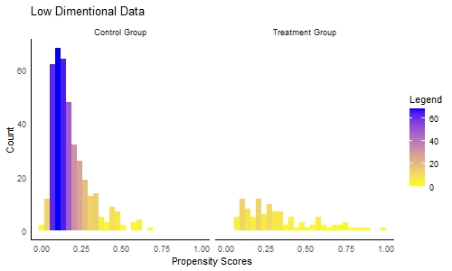
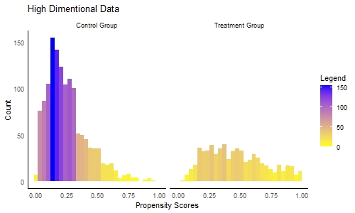
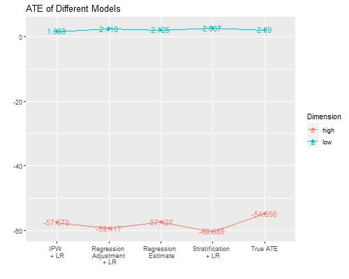
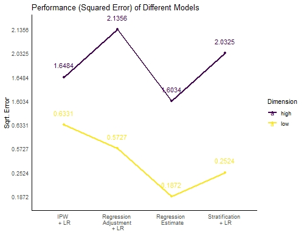
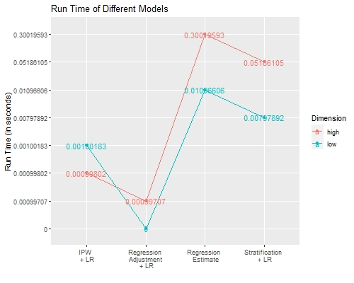

# Basic Setup
```{r setup, include=FALSE}
knitr::opts_chunk$set(echo = TRUE, message = F, warning = F,
                      options(width = 60),
                      matrix(runif(100), ncol = 20))
```

```{r load libraries and data, message=FALSE, warning=FALSE}
#Test Branch created
if(!require("readr")){
  install.packages("readr")
}
if(!require("tidyverse")){
  install.packages("tidyverse")
}
if(!require("glmnet")){
  install.packages("glmnet")
}
if(!require("pryr")){
  install.packages("pryr")
}
if(!require("viridis")){
  install.packages("viridis")
}

library(viridis)
library(readr)
library(tidyverse)
library(glmnet)
library(pryr)

lowDim_raw <- read_csv('../data/lowDim_dataset.csv')
highDim_raw <- read_csv('../data/highDim_dataset.csv')

lowDim <- lowDim_raw
highDim <- highDim_raw
```
\newpage

# Project Overview

We will evaluate four inference algorithm in this project, Inverse Propensity Weighting (IPW) + Logistic Regression, Regression Estimate, Stratification + Logistic Regression, and Regression Adjustment + Logistic Regression. We will compute the average treatment effect (ATE) using the four algorithms on two distinct datasets (low dimension & high dimension), and we will compare their performance and computational efficiency.

# Propensity Scores

By definition, a **propensity score** is the probability of a unit being assigned to a particular treatment given a set of observed covariates, and the purpose to use propensity scores is to reduce selection bias by equating groups based on those covariates. In this project, we estimate the propensity scores using logistic regression:  
\[logit[Pr(T=1|X)]=\beta_0 + \beta_1x_1 + ... + \beta_px_p
\]
\[
Pr(T=1|X)=\frac{1}{1+e^{-(\beta_0+\beta_1x_1+...+\beta_px_p)}}
\]  

## Getting PS

In R, we used the **glm** function to build the logistic regression model based on both High-Dimention and Low-Dimention Dataset, and then we estimated propensity scores for both datasets based on the model. Finally, we did some exploratory data analysis for the propensity scores, summarizing the means and the distributions of them.  

```{r Getting PS, message=FALSE}
# High Dimentional Data
ps_high_estimate <- glm(data = highDim,
                        formula = A~ . -Y,
                        family=binomial())
ps_high_data <- data.frame(ps = predict(ps_high_estimate,type="response"),
                           treatment = ps_high_estimate$model$A)
# Low Dimentional Data
ps_low_estimate <- glm(data = lowDim,
                       formula = A~ . -Y,
                       family=binomial())
ps_low_data <- data.frame(ps = predict(ps_low_estimate,type="response"),
                          treatment = ps_low_estimate$model$A)
# Show PS means
(ps_means <- data.frame(high_treat_ps_mean = mean(ps_high_data[ps_high_data$treatment==1,]$ps),
                       high_control_ps_mean = mean(ps_high_data[ps_high_data$treatment==0,]$ps),
                       low_treat_ps_mean = mean(ps_low_data[ps_low_data$treatment==1,]$ps),
                       low_control_ps_mean = mean(ps_low_data[ps_low_data$treatment==0,]$ps)))
```
## Visualize PS
```{r, echo=FALSE}
## Plot Counts
jpeg(filename="../figs/ps_high.jpeg", width = 500, height = 300,quality = 10000)
ps_high_data %>%
  mutate(treatment = ifelse(treatment == 0, "Control Group", "Treatment Group")) %>%
  ggplot(aes(x=ps, fill=..count..))+
  ggtitle("High Dimentional Data")+
  xlab("Propensity Scores")+
  ylab("Count")+
  geom_histogram()+
  scale_fill_gradient("Legend",low = "yellow", high = "blue") +
  theme_minimal()+
  theme(axis.line = element_line(),
        panel.grid.major = element_blank(),
        panel.grid.minor = element_blank(),
        panel.border = element_blank(),
        panel.background = element_blank())+
  facet_wrap(~treatment)
while (!is.null(dev.list()))  dev.off()

jpeg(filename="../figs/ps_low.jpeg", width = 500, height = 300,quality = 10000)
ps_low_data %>%
  mutate(treatment = ifelse(treatment == 0, "Control Group", "Treatment Group")) %>%
  ggplot(aes(x=ps, fill=..count..))+
  ggtitle("Low Dimentional Data")+
  xlab("Propensity Scores")+
  ylab("Count")+
  geom_histogram()+
  scale_fill_gradient("Legend",low = "yellow", high = "blue") +
  theme_minimal()+
  theme(axis.line = element_line(),
        panel.grid.major = element_blank(),
        panel.grid.minor = element_blank(),
        panel.border = element_blank(),
        panel.background = element_blank())+
  facet_wrap(~treatment)
while (!is.null(dev.list()))  dev.off()
```
```{r,echo=FALSE}

```
```{r,echo=FALSE}

```
\newpage
First, it is important to mention that high-dimensional data and low dimensional data have the same distribution for propensity scores regarding the treatment and control group.  

Let's focus on the high-dimensional data. There is a large number of individuals within the control group with propensity score around 0.1, rather than the treatment group have a uniform distribution. Samely, for the low-dimensional data, the control group follows a gaussian-like distribution around 0.10, rather than the treatment group is more uniform across propensity scores.  

# Algorithm 1: Inverse Propensity Weighting and Logistic Regression
Inverse Propensity score is one method of propensity score weighting, which is is an alternative way to propensity score matching. It can effectively remove the bias by re-weighting the data with weights inversely proportional to the probability of selection. Averaging with known inverse sampling weights was introduced by Horvitz and Thompson in 1952 and has been further studied in recent KDD papers.
\[
w_i = \frac{T_i}{\hat{e_i}}+\frac{1-T_i}{1-\hat{e_i}}
\]
the sum of the weights over the controls equals one.
where $\hat{e_i}$ is the estimated propensity score for individual $i$.  
Estimate ATE:  
\[
\hat{\triangle}_{IPW} = N^{-1}(\sum\limits_{i \in Treated}{w_iY_i}-\sum\limits_{i \in Controlled}{w_iY_i})
\]
where the first summation is from the treated group, and the second summation is from the controlled group.  
However, the IPW will have high variance if p (X) is close to one for some controls.The propensities close to one arise if X nearly separates the controls and exposed or the algorithm used to estimate the propensities is unstable.

```{r}
set.seed(0)
# Write Algorithm
IPW <- function(df,ps){
  start <- Sys.time()
  ps['weights'] <- df$A/ps$ps+(1-df$A)/(1-ps$ps)
  treatment <- sum(ps[ps$treatment==1,]$weights*df$Y[df$A==1])
  controll <- sum(ps[ps$treatment==0,]$weights*df$Y[df$A==0])
  ATE <- (treatment-controll)/nrow(df)
  end <- Sys.time()
  runtime = end - start
  return(list(ATE=ATE,runtime=runtime))
}
# Output Performance
matrix(c(IPW(highDim,ps_high_data)$ATE,
         IPW(lowDim,ps_low_data)$ATE,
         IPW(highDim,ps_high_data)$runtime,
         IPW(lowDim,ps_low_data)$runtime),
       nrow = 2,byrow = TRUE,
       dimnames = list(c("ATE","Running Time (secs)"), c("High Dimension","Low Dimension")))
```


# Algorithm 2: Regression Estimate
In this section, we estimated ATE by using a simple regression, and it does not need propensity score.
Based on Chan et al. (2010),
\[
\hat{\triangle}_{reg_{ATT}}= n_1^{-1} \sum\limits_{exposed}(\hat{m_1}(X_i)-\hat{m_0}(X_i)),n_1=\sum\limits^n\limits_{i=1}Z_i
\]
Here, they estimated ATT, but we are interested in ATE, so the formula that we used is below:
\[
\hat{\triangle}_{reg_{ATE}} = N^{-1}\sum\limits_{i=1}\limits^{N}(\hat{m_1}-\hat{m_0}{(X_i)})
\]
where $\hat{m_1}$ is the model that using A=1 (Treatment Group), and $\hat{m_1}$ is the model that using A=0 (Controlled Group).

```{r}
set.seed(0)
# Write Algorithm
Regression_Estimate <- function(df){
  start <- Sys.time()
  model_0 <- glm(Y ~ ., data = subset(df[df$A==0,], select = -A))
  model_1 <- glm(Y ~ ., data = subset(df[df$A==1,], select = -A))
  ATE = 1/nrow(df) * sum(predict(model_1, newdata = df%>% select(-Y,-A)) - 
                           predict(model_0, newdata = df%>% select(-Y,-A)))
  end <- Sys.time()
  runtime = end - start
  return(list(ATE = ATE, runtime = runtime))
}

# Output Performance
matrix(c(Regression_Estimate(highDim)$ATE,
         Regression_Estimate(lowDim)$ATE,
         Regression_Estimate(highDim)$runtime,
         Regression_Estimate(lowDim)$runtime),
         nrow = 2,
         byrow = TRUE,
         dimnames = list(c("ATE","Running Time (secs)"), c("High Dimension","Low Dimension")))
```

# Algorithm 3: Stratification and Logistic Regression

\[
\hat{\triangle}_S = \sum\limits^K\limits_{j = 1} \frac{N_j}{N}(N_{1j}^{-1} \sum\limits^{N}\limits_{i=1}T_iY_iI(\hat{e}_i \in \hat{Q_j})-N_{0j}^{-1}\sum\limits^{N}\limits_{i=1}(1-T_i)Y_iI(\hat{e}_i \in \hat{Q}_j))
\]
where $K$ is the number of strata (K=5).  
$N_j$ is the number of individuals in stratum $j$.  
$N_{1j}$ is the number of "treated" individuals in stratum $j$, and $N_{0j}$ is the number of "controlled" individuals in stratum $j$.  
$\hat{Q}_j=(\hat{q}_{j-1},\hat{q}_j)$ where $\hat{q}_j$ is the jth sample quantile of the estimated propensity scores.  

Estimation of treatment effects with causal interpretation from raw data is hard because exposure to treatment may be confounded with subject characteristics. Therefore, we need to use stratification to adjust for confounding.

In our implementation, we can select k where k represented the number of the strata. With the help of strata, we can fist cauculate the data which have similar propeties from the propensity score aspect. We also tested which K value in the formula above has the best performance. In the last part of this section, from the graph, we can see that K=8 should provide the best result (lowest squared error for both high and low dimensional datasets).

```{r}
set.seed(0)
# Write Algorithm
Strat <- function(df, ps, k=8){
  start = Sys.time()
  ATE <- 0
  prev <- 0
  cancatdata <- cbind(df, ps)
  for (i in 1:k) {
    ps_str = as.numeric(ps$ps)
    str_q <- quantile(ps_str, (1/k)*i)
    str_data <- cancatdata[cancatdata$ps>=prev,]
    str_data <- str_data[str_q>=str_data$ps,]
    prev = str_q
    temp_t <- sum(str_data$Y[str_data$A==1])
    temp_t <- 1/nrow(str_data[str_data$A==1,])*temp_t
    temp_c <- sum(str_data$Y[str_data$A==0])
    temp_c <- 1/nrow(str_data[str_data$A==0,])*temp_c
    str_e <- temp_t - temp_c
    ATE <- ATE + str_e*nrow(str_data)/nrow(df)
  }
  end = Sys.time()
  runtime = end - start
  return(list(ATE = ATE, runtime = runtime))
}
# Output Performance
stra_result_high <- matrix(0, nrow = 10, ncol = 4, 
                    dimnames = list(c("1","2","3","4","5","6","7","8","9","10"), 
                                c("K","ATE","Running Time (secs)","Sq_Error")))
stra_result_low <- matrix(0, nrow = 10, ncol = 4, 
                    dimnames = list(c("1","2","3","4","5","6","7","8","9","10"),
                                c("K","ATE","Running Time (secs)","Sq_Error")))
for (i in 1:10){
  stra_result_high[i,] <- c(i,
                            Strat(highDim,ps_high_data, i)$ATE, 
                            Strat(highDim,ps_high_data, i)$runtime, 
                            sqrt(abs(-54.8558-Strat(highDim,ps_high_data, i)$ATE)))
  stra_result_low[i,] <- c(i,
                           Strat(lowDim,ps_low_data, i)$ATE, 
                           Strat(lowDim,ps_low_data, i)$runtime,
                           sqrt(abs(2.0901-Strat(highDim,ps_high_data, i)$ATE)))
}
stra_result_high <- as.data.frame(stra_result_high)
stra_result_low <- as.data.frame(stra_result_low)
matrix(c(Strat(highDim,ps_high_data)$ATE,
         Strat(lowDim,ps_low_data)$ATE,
         Strat(highDim,ps_high_data)$runtime,
         Strat(lowDim,ps_low_data)$runtime),
       nrow = 2,
       byrow = TRUE,
       dimnames = list(c("ATE","Running Time (secs)"), 
                       c("High Dimension","Low Dimension")))
```

```{r, echo=FALSE}
# Plot Different K
Summary_K <-rbind(K_low <- stra_result_low %>% mutate(Dimension = "Low"), 
                  K_high <- stra_result_high %>% mutate(Dimension="High"))
ggplot(Summary_K, aes(K, Sq_Error, group=Dimension, col = Dimension)) +
  geom_point() +
  geom_line()+
  labs(title='Squared Error of Different Ks in Stratification',
       x='',
       y='',
       col='Dimension')
```

# Algorithm 4: Regression Adjustment and Logistic Regression

Regress the outcome variable Y on treatment indicator variable T and the estimated propensity score. Then, the estimated coefficient on the treatment indicator variable would be an estimate of ATE.  
In this method, we regress the response variable ($Y$) with the treatment variable ($A$) and the propensity scores estimated using our model above, in this case, logistic regression. The estimated coefficient of the treatment variable ($A$) is then an estimate of the ATE.

D’Agostino (1998) and Austin (2011) compare regression adjustment with more traditional propensity score methods. One of the main advantages of the regression adjustment is in its simplicity in execution, in which one performs a somewhat basic linear regression model on two covariates and one response variable.

However, depending on the size of the dataset, this may run into computation issues as linear regression involves finding the inverse of a matrix. Additionally, regression adjustment may also not be helpful in cases where there is a strong separation between the two groups.

No such issues were present in this setup given that both datasets had a relatively small number of observations and there is no clear separation between the two groups
```{r}
set.seed(0)
# Write Algorithm
Reg_adj <- function(df,ps_data){
  df<- data.frame(cbind(Y=df$Y,A=df$A,ps=ps_data$ps))
  start <- Sys.time()
  m<- lm(Y ~ A+ ps, data = df)
  ATE = m$coefficients[2]
  end <- Sys.time()
  runtime = end - start
  return(list(ATE = ATE, runtime = runtime))
}
# Output Performance
matrix(c(Reg_adj(highDim,ps_high_data)$ATE,
         Reg_adj(lowDim,ps_low_data)$ATE,
         Reg_adj(highDim,ps_high_data)$runtime,
         Reg_adj(lowDim,ps_high_data)$runtime),
       nrow = 2,
       byrow = TRUE,
       dimnames = list(c("ATE","Running Time (secs)"),
                       c("High Dimension","Low Dimension")))
```

\newpage
# Model Comparisons

Performance is measured by the squared differences of true ATEs and estimated ATEs for all four algorithms, and run-times are measured in seconds.
```{r Comparing Result, echo=FALSE}
set.seed(0)
high_dim_result <- data.frame(
                               Algorithm = c("True ATE",
                                         "IPW + LR",
                                         "Regression Estimate",
                                         "Stratification + LR",
                                         "Regression Adjustment + LR"),

                               ATE = c(-54.8558,
                                       round(IPW(highDim,ps_high_data)$ATE,4),
                                       round(Regression_Estimate(highDim)$ATE,4),
                                       round(Strat(highDim,ps_high_data)$ATE,4),
                                       round(Reg_adj(highDim,ps_high_data)$ATE,4)),

                               Run_Time = c("N.A",
                                            round(IPW(highDim,ps_high_data)$runtime[[1]],8),
                                            round(Regression_Estimate(highDim)$runtime[[1]],8),
                                            round(Strat(highDim,ps_high_data)$runtime[[1]],8),
                                            round(Reg_adj(highDim,ps_high_data)$runtime[[1]],8)),

                               Squared_Error = c("N.A.",
                                               round(sqrt(abs(-54.8558-IPW(highDim,ps_high_data)$ATE)),4),
                                               round(sqrt(abs(-54.8558-Regression_Estimate(highDim)$ATE)),4),
                                               round(sqrt(abs(-54.8558-Strat(highDim,ps_high_data)$ATE)),4),
                                               round(sqrt(abs(-54.8558-Reg_adj(highDim,ps_high_data)$ATE)),4))
                               )

low_dim_result <- data.frame(
                               Algorithm = c("True ATE",
                                         "IPW + LR",
                                         "Regression Estimate",
                                         "Stratification + LR",
                                         "Regression Adjustment + LR"),

                               ATE = c(2.0901,
                                       round(IPW(lowDim,ps_low_data)$ATE,4),
                                       round(Regression_Estimate(lowDim)$ATE,4),
                                       round(Strat(lowDim,ps_low_data)$ATE,4),
                                       round(Reg_adj(lowDim,ps_low_data)$ATE,4)),

                               Run_Time = c("N.A",
                                            round(IPW(lowDim,ps_low_data)$runtime[[1]],8),
                                            round(Regression_Estimate(lowDim)$runtime[[1]],8),
                                            round(Strat(lowDim,ps_low_data)$runtime[[1]],8),
                                            round(Reg_adj(lowDim,ps_low_data)$runtime[[1]],8)),

                               Squared_Error = c("N.A.",
                                               round(sqrt(abs(2.0901-IPW(lowDim,ps_low_data)$ATE)),4),
                                               round(sqrt(abs(2.0901-Regression_Estimate(lowDim)$ATE)),4),
                                               round(sqrt(abs(2.0901-Strat(lowDim,ps_low_data)$ATE)),4),
                                               round(sqrt(abs(2.0901-Reg_adj(lowDim,ps_low_data)$ATE)),4))
                               )
```

## Low Dimension Dataset
```{r echo=FALSE}
knitr::kable(low_dim_result)
```

## High Dimension Dataset
```{r echo=FALSE}
knitr::kable(high_dim_result)
```
From the tables above, we can find that Regression Estimate has the best performance on both Low and High Dimensional Datasets in terms of the lowest squared errors in both cases.  
\newpage  

# Plotting the Result
```{r, echo=FALSE}

high_results_plot <- high_dim_result %>%
  mutate(Dimension = 'high') %>%
  mutate(Algorithm = c("True ATE",
                   "IPW \n + LR",
                   "Regression \n Estimate",
                   "Stratification \n + LR",
                   "Regression \n Adjustment \n + LR"))
low_results_plot <- low_dim_result %>%
  mutate(Dimension = 'low') %>%
  mutate(Algorithm = c("True ATE",
                   "IPW \n + LR",
                   "Regression \n Estimate",
                   "Stratification \n + LR",
                   "Regression \n Adjustment \n + LR"))
Summary_df <- rbind(low_results_plot, high_results_plot)

#plots
true_ATE_high_dim = -54.8558
true_ATE_low_dim =  2.0901

#plots

jpeg(filename="../figs/ATE.jpeg", width = 500, height = 600,quality = 5000)
ggplot(Summary_df[c(2,3,4,5,7,8,9,10),], aes(Algorithm, ATE)) +
  geom_bar(data = high_results_plot, aes(fill="High"),  stat='identity', width = 0.5, alpha = 0.8)+
  geom_bar(data = low_results_plot, aes(fill="Low"), stat='identity', width = 0.5, alpha = 0.8)+
  labs(title='ATE of Different Models',
       x='',
       y='',
       col='Dimension') + 
  geom_hline(yintercept = true_ATE_high_dim,linetype='dashed',  color = "red")+
  geom_hline(yintercept = true_ATE_low_dim,linetype='dashed',  color = "purple")+
  theme_minimal()+
  theme(axis.line = element_line(),
        panel.grid.major = element_blank(),
        panel.grid.minor = element_blank(),
        panel.border = element_blank(),
        panel.background = element_blank())+
  geom_text(aes(label=as.character(ATE)), nudge_y = 1)+
  scale_fill_viridis(discrete=TRUE, direction=-1)
while (!is.null(dev.list()))  dev.off()

jpeg(filename="../figs/performance.jpeg", width = 500, height = 400,quality = 1300)
ggplot(Summary_df[c(2,3,4,5,7,8,9,10),], aes(Algorithm, Squared_Error, group=Dimension, col = Dimension)) +
  geom_point() +
  geom_line(size = 1)+
  scale_color_viridis(discrete=TRUE)+
  labs(title='Performance (Squared Error) of Different Models',
       x='',
       y='Sqrt. Error',
       col='Dimension') +
  theme_minimal()+
  theme(axis.line = element_line(),
        panel.grid.major = element_blank(),
        panel.grid.minor = element_blank(),
        panel.border = element_blank(),
        panel.background = element_blank())+
  geom_text(aes(label=as.character(Squared_Error)), nudge_y = .5)
while (!is.null(dev.list()))  dev.off()


jpeg(filename="../figs/runtime.jpeg", width = 500, height = 400,quality = 1300)
ggplot(Summary_df[c(2,3,4,5,7,8,9,10),], aes(Algorithm, Run_Time, group=Dimension, col = Dimension)) +
  geom_point() +
  geom_line(size=1)+
  scale_color_viridis(discrete=TRUE)+
  labs(title='Run Time of Different Models',
       x='',
       y='Run Time (in seconds)',
       col='Dimension') +
  theme_minimal()+
  theme(axis.line = element_line(),
        panel.grid.major = element_blank(),
        panel.grid.minor = element_blank(),
        panel.border = element_blank(),
        panel.background = element_blank())+
  geom_text(aes(label=as.character(Run_Time), nudge_y = 2))
while (!is.null(dev.list()))  dev.off()
```
```{r,echo=FALSE}

```
```{r,echo=FALSE}

```
```{r,echo=FALSE}

```
\newpage  

# Conclusion
Among four different algorithms, IPW (with Logistic Regression (LR)), Regression Estimate, Stratification (with LR), and Regression Adjustment (with LR), Regression Estimate has the best performances with both high and low dimension datasets since it has the lowest squared errors in both cases. However, Regression Adjustment algorithm will take more computational cost than other algorithms (longer run-time). Besides, the squared errors for high dimensional dataset are all larger than the squared errors of low dimensional dataset for all four algorithms. In terms of computational cost, for Regression Estimate and Stratification (with LR), the run-times of high dimensional dataset is longer than the run-times for low dimensional dataset, but for Regression Adjustment (with LR) and IPW (with LR), the run-times of both datasets are similar. However, since the run-times for all four algorithms are lower than 0.18 seconds even when calculating the ATE for high dimentianl dataset, we can ignore their differences in computational costs. Therefore, we think Regression Estimate is the best algorithm when estimating the ATE of both datasets.

# Reference

Austin, Peter C. 2011. “An Introduction to Propensity Score Methods for Reducing the Effects of Confounding in Observational Studies.” Multivariate Behavioral Research 46 (3): 399–424.  

Chan, David, Rong Ge, Ori Gershony, Tim Hesterberg, and Diane Lambert. 2010. “Evaluating Online Ad Campaigns in a Pipeline: Causal Models at Scale.” In Proceedings of the 16th Acm Sigkdd International Conference on Knowledge Discovery and Data Mining, 7–16.  

Lunceford, Jared K, and Marie Davidian. 2004. “Stratification and Weighting via the Propensity Score in Estimation of Causal Treatment Effects a Comparative Study.” Statistics in Medicine 23 (19): 2937–60.  

Stuart, Elizabeth A. 2010. “Matching Methods for Causal Inference: A Review and a Look Forward.” Statistical Science: A Review Journal of the Institute of Mathematical Statistics 25 (1): 1.  
